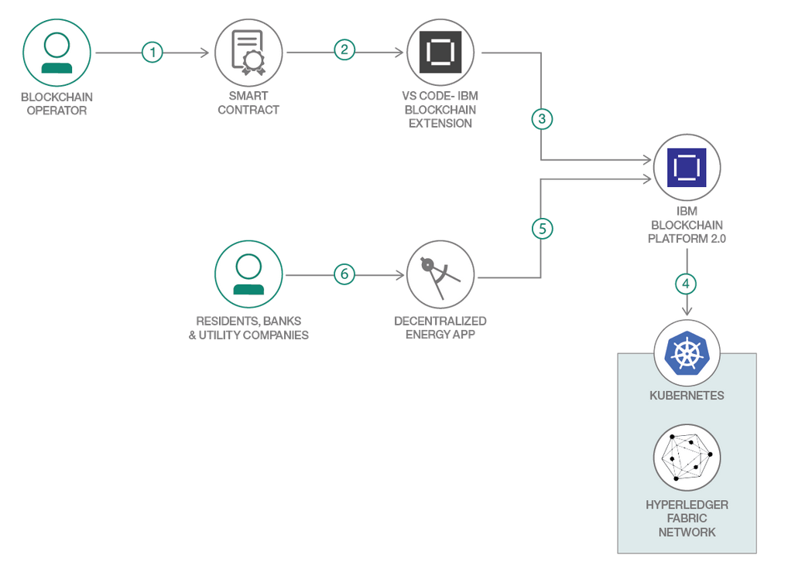
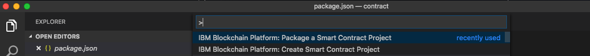
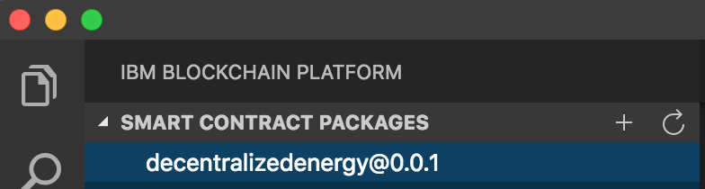
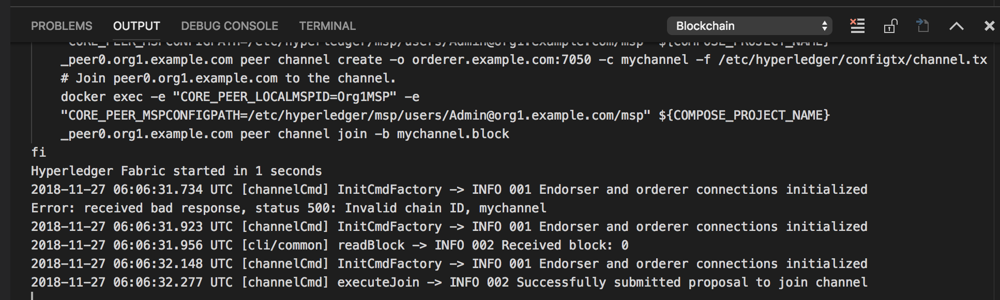
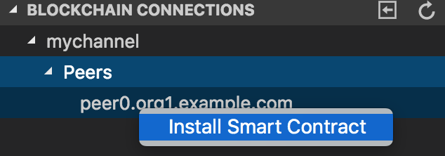
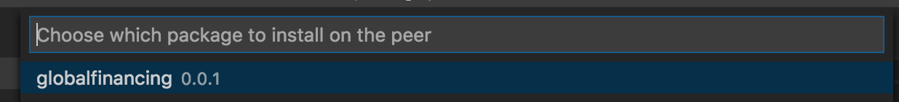
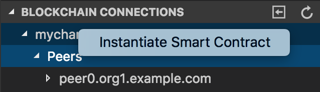
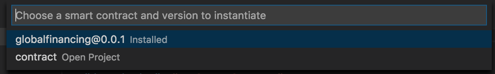
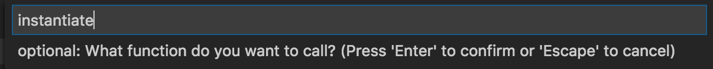
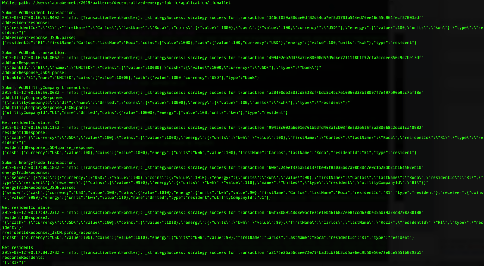

# Decentralized Energy with Blockchain

A key application of Blockchain being currently explored is a Decentralized Energy network. The idea stems from a neighborhood where certain Residents are producing energy through Solar panels or other means, and can sell excess energy to Residents needing energy. The transactions would be based on coins in each Resident's account. As per a pre-determined contract and rate, the coins would be debited from the consumer and credited to the producer, for a certain billing period. Each transaction would need to be atomic and added to a Blockchain ledger for trust and verification. The network can include Banks to transact coins for Fiat currency (USD). The network can have Utility Company who can buy or provide energy through the network.

The network consists of Residents, Banks and Utility Companies. Residents can exchange coins for energy among each other.  The application assumes a pre-paid system where transactions occur after the energy is consumed and the values are updated.  The Resident can exchange coins for Fiat money (USD) with Banks on the network.  The Residents can also transact coins for energy with a Utility company on the network.

The code pattern demonstrates how a Node.js smart contract can be packaged using the IBM Blockchain Platform Extension for VS Code. Then, using the extension, you can set up a local instance of the Hyperledger Fabric network, on which you can install and instantiate the contract. 

When you have completed this code pattern, you will understand how to:

* Develop a Node.js smart contract
* Package and deploy the smart contract to a local instance of Hyperledger Fabric using IBM Blockchain Platform Extension for VS Code
* Interact with the contract and execute transactions using a simple command-line application.


# Architecture flow

<p align="center">
  
</p>

The developer uses the IBM Blockchain Platform Extension for VS Code to:

1. Package a smart contract.
2. Launch a local Hyperledger Fabric Network.
3. Install chaincode on the peer node.
4. Instantiate the chaincode on the peer node.
5. Execute the decentralized energy smart contract transactions from client applications.

# Included components

* [IBM Blockchain Platform Extension for VS Code](https://marketplace.visualstudio.com/items?itemName=IBMBlockchain.ibm-blockchain-platform) is designed to assist users in developing, testing, and deploying smart contracts -- including connecting to Hyperledger Fabric environments.
* [Hyperledger Fabric v1.4](https://hyperledger-fabric.readthedocs.io) is a platform for distributed ledger solutions, underpinned by a modular architecture that delivers high degrees of confidentiality, resiliency, flexibility, and scalability.
* [Visual Studio Code](https://code.visualstudio.com/download) is a code editor that's redefined and optimized for building and debugging modern web and cloud applications.

## Featured technologies
+ [Node.js](https://nodejs.org/en/) is an open source, cross-platform JavaScript run-time environment that executes server-side JavaScript code.


## Prerequisites

You will need to follow the requirements for the [IBM Blockchain Platform Extension for VS Code](https://github.com/IBM-Blockchain/blockchain-vscode-extension/blob/master/README.md#requirements):

- [VSCode version 1.26 or greater](https://code.visualstudio.com)
- [Node v8.x or greater and npm v5.x or greater](https://nodejs.org/en/download/)
- [Yeoman (yo) v2.x](http://yeoman.io/)
- [Docker version v17.06.2-ce or greater](https://www.docker.com/get-docker)
- [Docker Compose v1.14.0 or greater](https://docs.docker.com/compose/install/)

### Clean up Docker images

Before starting, you need to do a little housekeeping. Run the following command to kill any stale or active containers:

 ```bash
  docker rm -f $(docker ps -aq)
  ```

Clear any cached networks and volumes:

```bash
  docker network prune ; docker volume prune
  ```

Finally, if you’ve already run through this tutorial or tried it previously, you’ll also want to delete the underlying chaincode image for the commercial paper smart contract. If you’re going through this content for the first time, then you won’t have this chaincode image on your system (so you won’t need to perform this next step). Get the container ID using:

```bash
  docker rmi $(docker images -q dev*)
  ```

It will remove any lingering container images related to previous instantiated decentralizedenergy containers.

### Launch VSCode and install the IBM Blockchain Platform extension for VSCode

You can launch VSCode from the task bar, or by typing code in a terminal window.

Now you need to install the IBM Blockchain Platform VSCode extension — you’ll need to install the latest version of VSCode to do this. To see if you have the latest version, `go to Code ->  Check for Updates`. If VSCode exits at this point, it likely means you don’t have the latest version. If so, update your VSCode (using the link provided earlier) and once you’re done, click on `extensions` in the sidebar on the left side of your screen. At the top, search the extensions marketplace for IBM Blockchain Platform and click on `Install`. You should see a status of “Installing” and eventually “Installed” — then click on `reload`.

Figure 2. Find and install the extension from VSCode marketplace <GET PIC FROM COMMERICAL PAPER TUTORIAL>

# Running the application

Follow these steps to set up and run this code pattern. The steps are described in detail below.

### Steps

1. [Clone the repo](#1-clone-the-repo)
2. [Use the VS Code extension to set up a smart contract on a basic Fabric network](#2-use-the-vs-code-extension-to-set-up-a-smart-contract-on-a-basic-fabric-network)
3. [Execute the Smart Contracts](#3-Execute-Smart-Contracts)


## 1. Clone the repo

Clone this repository in a folder your choice:

```
git clone https://github.com/IBM/decentralized-energy-fabric-w-vscode.git
```


## 2. Use the VS Code extension to set up a smart contract on a basic Fabric network

Open Visual Studio code and open the `contract` folder.

### Package the smart contract

Press the `F1` key to see the different VS code options. Choose `IBM Blockchain Platform: Package a Smart Contract Project`.

<p align="center">
  
</p>

Click the `IBM Blockchain Platform` extension button on the left. This will show the packaged contracts on top and the blockchain connections on the bottom.

<p align="center">
  
</p>

### Setup local_fabric

Click on `local_fabric` to start a network. This will download the Docker images required for a local Fabric setup, and start the network. You should see the output window as the network sets up.

<p align="center">
  
</p>

Click on `local_fabric` again; it should have a full white circle next to it. This should bring up `mychannel`. You are now ready to install the smart contract.


### Install and instantiate the smart contract

Click on `mychannel`, then `Peers`. This will display `peer0.org1.example.com`. Right click on it and choose `Install Smart Contract`:

<p align="center">
  
</p>

Choose the `decentralizedenergy@0.0.1` contract:

<p align="center">
  
</p>

You are now ready to instantiate the smart contract. Right click on `mychannel` and choose `Instantiate Smart Contract`:

<p align="center">
  
</p>

Choose the `decentralizedenergy@0.0.1` contract:

<p align="center">
  
</p>

Type in `instantiate` for the function:

<p align="center">
  
</p>

You can press **Enter** for optional arguments.  

Once this is successfully instantiated, you should see a successful notification in the output view.

## 3. Run the application

You have installed and instantiated your smart contract on the blockchain. Now it is time to try out the smart contract transactions. In a new terminal, navigate to the `application` directory:

  ```bash
  cd decentralized-energy-fabric/application/
  ```

  Build the node dependencies:
  ```bash
  npm install
  ```

  Run the application:
  ```bash
  npm application
  ```

The application will perform the following transactions:
* Create a resident
* Create a Bank transaction
* Create a Utility Company
* Get the ID of the resident
* Submit an EnergyTrade
* Get the Residents State
* Get a listing of all the residents

You should see the following:

<div style='border: 2px solid #f00;'>
  
</div>


## Extending the code pattern
This application can be expanded in a couple of ways:
* Create a wallet for every member and use the member's wallet to interact with the application.
* Update the application to interact through the IBM Blockchain Platform starter plan on IBM Cloud.


## Links
* [Hyperledger Fabric Docs](http://hyperledger-fabric.readthedocs.io/en/latest/)
* [Zero to Blockchain](https://www.redbooks.ibm.com/Redbooks.nsf/RedbookAbstracts/crse0401.html?Open)
* [IBM Code Patterns for Blockchain](https://developer.ibm.com/patterns/category/blockchain/)

## License
This code pattern is licensed under the Apache Software License, Version 2. Separate third-party code objects invoked within this code pattern are licensed by their respective providers pursuant to their own separate licenses. Contributions are subject to the [Developer Certificate of Origin, Version 1.1 (DCO)](https://developercertificate.org/) and the [Apache Software License, Version 2](https://www.apache.org/licenses/LICENSE-2.0.txt).

[Apache Software License (ASL) FAQ](https://www.apache.org/foundation/license-faq.html#WhatDoesItMEAN)
